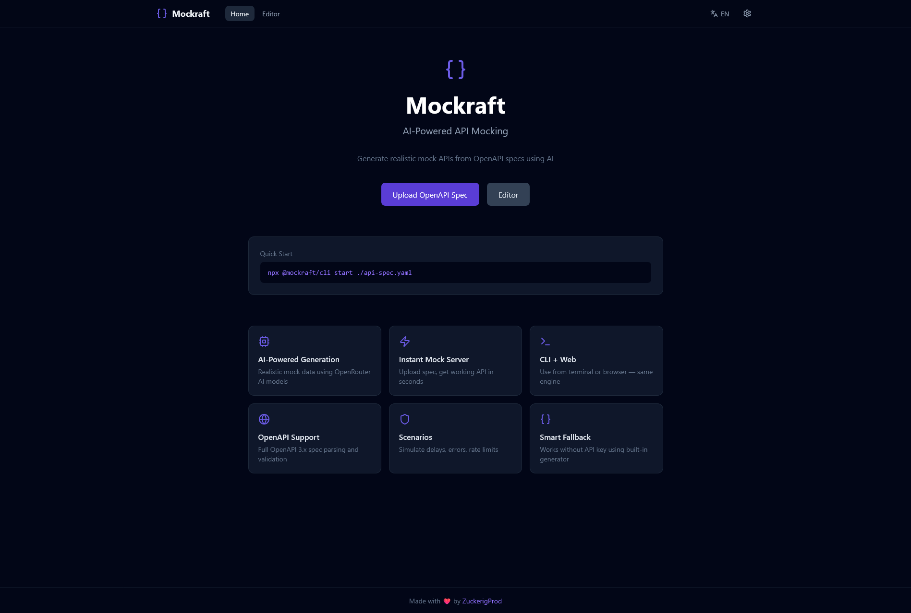
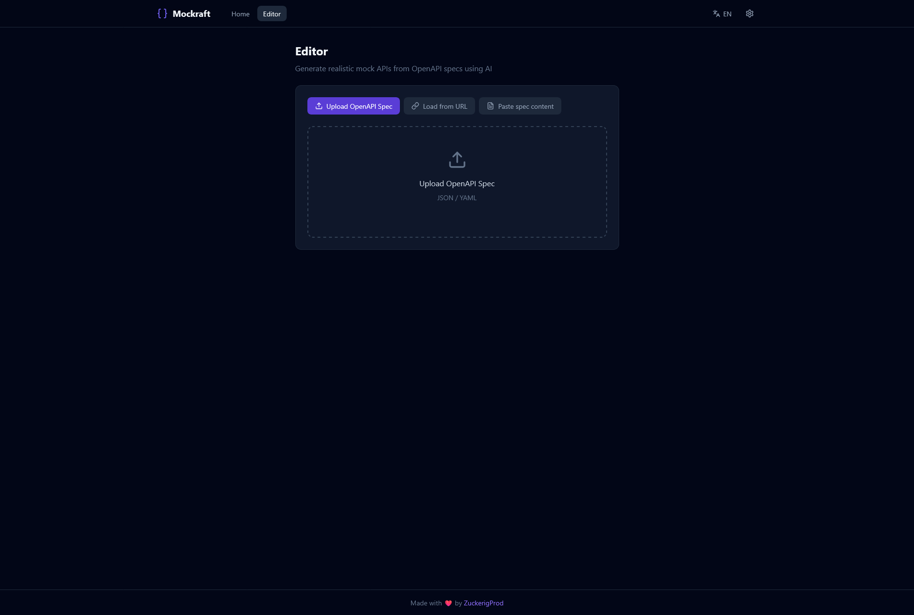
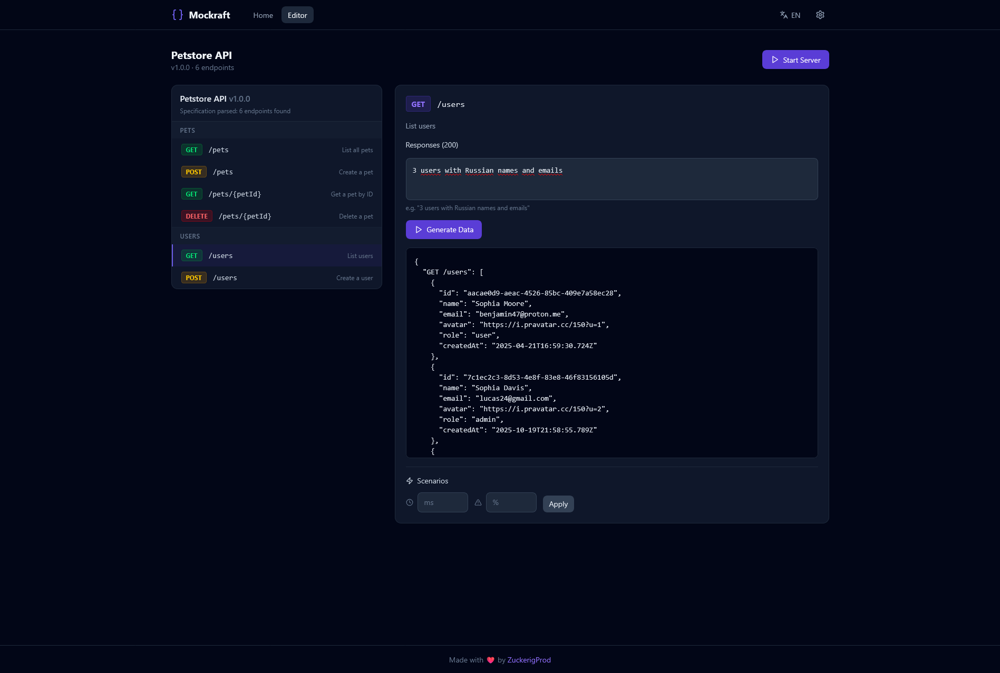
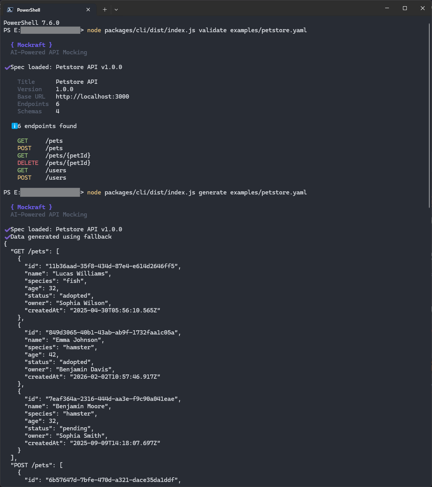

<p align="center">
  
</p>

<h1 align="center">Mockraft</h1>

<p align="center">
  <strong>AI-Powered API Mocking Tool</strong>
</p>

<p align="center">
  <a href="#english">English</a> | <a href="#russian">Русский</a>
</p>

<p align="center">
  Made with ❤️ by <a href="https://t.me/ZuckerigProd">ZuckerigProd</a>
</p>

<p align="center">
  
  
  
  
</p>

---

<a id="english"></a>

## English

Generate realistic mock APIs from OpenAPI specs using AI. Upload your spec — get a working mock server with smart data in seconds.

### Features

- **AI-Powered Data Generation** — Uses OpenRouter AI models (free & paid) to generate realistic, contextually appropriate mock data
- **Instant Mock Server** — Parse OpenAPI 3.x spec and spin up Express server automatically
- **CLI + Web Interface** — Same engine, use from terminal (`npx`) or browser
- **Smart Fallback** — Works without API key using built-in heuristic generator
- **Scenarios** — Simulate delays, errors (500, 503...), rate limiting per endpoint
- **Proxy Mode** — Route some requests to real API, others to mocks
- **Natural Language Config** — Describe what you want: *"3 users with Russian names"*
- **i18n** — English and Russian out of the box

### Screenshots

<p align="center">
  
</p>
<p align="center">
  
</p>
<p align="center">
  
</p>
<p align="center">
  
</p>

### Quick Start

```bash
git clone https://github.com/your-user/mockraft.git
cd mockraft
npm install
npm run build
```

#### Production

```bash
npm start
```

Opens at `http://localhost:4000` — frontend and API server together on a single port.

#### Development

```bash
# Terminal 1 — backend API server
npm run server

# Terminal 2 — frontend with hot reload
npx -w packages/web vite --host 0.0.0.0
```

Frontend at `http://localhost:5173`, API at `http://localhost:4000`.

#### CLI

```bash
# Start mock server from spec
node packages/cli/dist/index.js start ./examples/petstore.yaml

# Generate mock data to stdout
node packages/cli/dist/index.js generate ./examples/petstore.yaml

# Validate spec
node packages/cli/dist/index.js validate ./examples/petstore.yaml

# Save your OpenRouter API key
node packages/cli/dist/index.js config --key sk-or-v1-your-key-here
```

#### CLI Options

| Flag | Description |
|------|------------|
| `-p, --port <port>` | Server port (default: 3456) |
| `-k, --key <key>` | OpenRouter API key |
| `-m, --model <model>` | AI model to use |
| `-l, --lang <lang>` | Language: en / ru |
| `--proxy <url>` | Proxy unmatched requests |

### AI Models

Mockraft uses [OpenRouter](https://openrouter.ai/) for AI generation. Free models included:

| Model | Tier |
|-------|------|
| Gemma 4 31B | Free |
| Gemma 4 26B | Free |
| Nemotron 3 Super 120B | Free |
| Nemotron 3 Nano 30B | Free |
| MiniMax M2.5 | Free |
| Trinity Large | Free |
| Claude Sonnet 4 | Paid |
| GPT-4o | Paid |
| Gemini 2.5 Flash | Paid |

No API key needed — the fallback generator produces reasonable data using field name heuristics.

### Scripts

| Command | Description |
|---------|------------|
| `npm start` | Build frontend + start production server (port 4000) |
| `npm run server` | Start API server only (port 4000) |
| `npm run dev` | Vite dev server with hot reload (port 5173) |
| `npm run build` | Build all packages (core, cli, web) |

### Project Structure

```
mockraft/
├── packages/
│   ├── core/          # Shared engine: parser, AI, generator, server
│   │   └── src/
│   │       ├── ai/          # OpenRouter client, prompt builder, models
│   │       ├── generator/   # AI + fallback data generation
│   │       ├── parser/      # OpenAPI 3.x spec parser
│   │       ├── server/      # Express mock server, scenarios, proxy
│   │       ├── nlp/         # Natural language config parser
│   │       └── i18n/        # EN + RU translations
│   ├── cli/           # Command-line interface (Commander.js)
│   │   └── src/
│   │       ├── commands/    # start, generate, validate, config
│   │       └── ui/          # Terminal UI (chalk, ora)
│   └── web/           # React web interface
│       ├── src/
│       │   ├── components/  # UI components
│       │   ├── pages/       # HomePage, EditorPage
│       │   ├── store/       # Zustand state
│       │   └── api/         # Backend API calls
│       └── server.ts        # Express API + static server
├── examples/          # Sample OpenAPI specs (petstore.yaml)
├── logo.svg
├── LICENSE            # MIT
└── README.md
```

### Tech Stack

| Layer | Technology |
|-------|-----------|
| Frontend | React 19, TypeScript, Vite 6, Tailwind CSS 4 |
| Backend | Node.js, Express, TypeScript |
| CLI | Commander.js, Chalk, Ora |
| AI | OpenRouter API (fetch-based) |
| State | Zustand |
| i18n | i18next, react-i18next |
| Monorepo | npm workspaces |

### License

MIT

---

<a id="russian"></a>

## Русский

Генерация реалистичных моков API из OpenAPI спецификаций с помощью ИИ. Загрузите спецификацию — получите рабочий мок-сервер с умными данными за секунды.

### Возможности

- **ИИ-генерация данных** — Использует модели OpenRouter (бесплатные и платные) для генерации реалистичных данных
- **Мгновенный мок-сервер** — Парсинг OpenAPI 3.x спеки и автоматический запуск Express-сервера
- **CLI + Веб-интерфейс** — Один движок, используйте из терминала или браузера
- **Умный фоллбэк** — Работает без API-ключа благодаря встроенному генератору
- **Сценарии** — Симуляция задержек, ошибок (500, 503...), rate limiting по эндпоинтам
- **Прокси-режим** — Часть запросов на реальный API, часть на моки
- **Конфигурация на естественном языке** — Опишите что нужно: *"3 пользователя с русскими именами"*
- **i18n** — Английский и русский из коробки

### Скриншоты

<p align="center">
  
</p>
<p align="center">
  
</p>
<p align="center">
  
</p>
<p align="center">
  
</p>

### Быстрый старт

```bash
git clone https://github.com/your-user/mockraft.git
cd mockraft
npm install
npm run build
```

#### Продакшен

```bash
npm start
```

Открывается на `http://localhost:4000` — фронтенд и API-сервер вместе, один порт.

#### Разработка

```bash
# Терминал 1 — API-сервер
npm run server

# Терминал 2 — фронтенд с hot reload
npx -w packages/web vite --host 0.0.0.0
```

Фронтенд на `http://localhost:5173`, API на `http://localhost:4000`.

#### CLI

```bash
# Запуск мок-сервера из спецификации
node packages/cli/dist/index.js start ./examples/petstore.yaml

# Генерация мок-данных в stdout
node packages/cli/dist/index.js generate ./examples/petstore.yaml

# Валидация спецификации
node packages/cli/dist/index.js validate ./examples/petstore.yaml

# Сохранение API-ключа OpenRouter
node packages/cli/dist/index.js config --key sk-or-v1-ваш-ключ

# Переключение на русский язык
node packages/cli/dist/index.js start ./examples/petstore.yaml --lang ru
```

#### Параметры CLI

| Флаг | Описание |
|------|----------|
| `-p, --port <порт>` | Порт сервера (по умолчанию: 3456) |
| `-k, --key <ключ>` | API-ключ OpenRouter |
| `-m, --model <модель>` | Модель ИИ |
| `-l, --lang <язык>` | Язык: en / ru |
| `--proxy <url>` | Проксирование запросов |

### Модели ИИ

Mockraft использует [OpenRouter](https://openrouter.ai/) для ИИ-генерации. Бесплатные модели включены:

| Модель | Уровень |
|--------|---------|
| Gemma 4 31B | Бесплатно |
| Gemma 4 26B | Бесплатно |
| Nemotron 3 Super 120B | Бесплатно |
| Nemotron 3 Nano 30B | Бесплатно |
| MiniMax M2.5 | Бесплатно |
| Trinity Large | Бесплатно |
| Claude Sonnet 4 | Платно |
| GPT-4o | Платно |
| Gemini 2.5 Flash | Платно |

API-ключ не обязателен — встроенный генератор создает осмысленные данные на основе эвристик по именам полей.

### Скрипты

| Команда | Описание |
|---------|----------|
| `npm start` | Сборка фронта + запуск продакшен-сервера (порт 4000) |
| `npm run server` | Запуск только API-сервера (порт 4000) |
| `npm run dev` | Vite dev сервер с hot reload (порт 5173) |
| `npm run build` | Сборка всех пакетов (core, cli, web) |

### Структура проекта

```
mockraft/
├── packages/
│   ├── core/          # Общий движок: парсер, ИИ, генератор, сервер
│   │   └── src/
│   │       ├── ai/          # OpenRouter клиент, промпт-билдер, модели
│   │       ├── generator/   # ИИ + фоллбэк генерация данных
│   │       ├── parser/      # Парсер OpenAPI 3.x спецификаций
│   │       ├── server/      # Express мок-сервер, сценарии, прокси
│   │       ├── nlp/         # Парсер конфигурации на естественном языке
│   │       └── i18n/        # Переводы EN + RU
│   ├── cli/           # Интерфейс командной строки (Commander.js)
│   │   └── src/
│   │       ├── commands/    # start, generate, validate, config
│   │       └── ui/          # Terminal UI (chalk, ora)
│   └── web/           # React веб-интерфейс
│       ├── src/
│       │   ├── components/  # UI-компоненты
│       │   ├── pages/       # HomePage, EditorPage
│       │   ├── store/       # Zustand стейт
│       │   └── api/         # Вызовы к бэкенду
│       └── server.ts        # Express API + раздача статики
├── examples/          # Примеры OpenAPI спецификаций (petstore.yaml)
├── logo.svg
├── LICENSE            # MIT
└── README.md
```

### Стек технологий

| Слой | Технология |
|------|-----------|
| Фронтенд | React 19, TypeScript, Vite 6, Tailwind CSS 4 |
| Бэкенд | Node.js, Express, TypeScript |
| CLI | Commander.js, Chalk, Ora |
| ИИ | OpenRouter API (fetch) |
| Стейт | Zustand |
| i18n | i18next, react-i18next |
| Монорепо | npm workspaces |

### Лицензия

MIT
